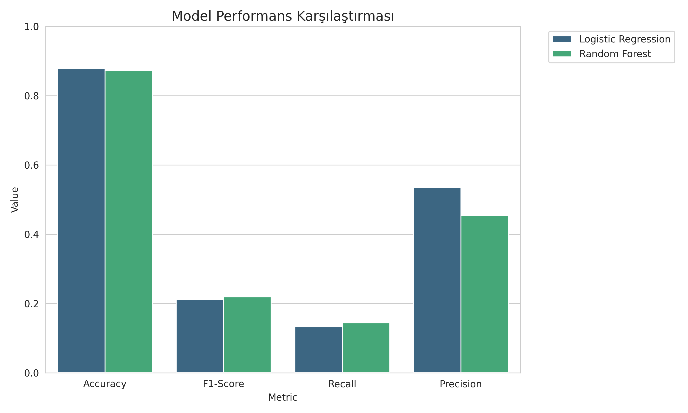
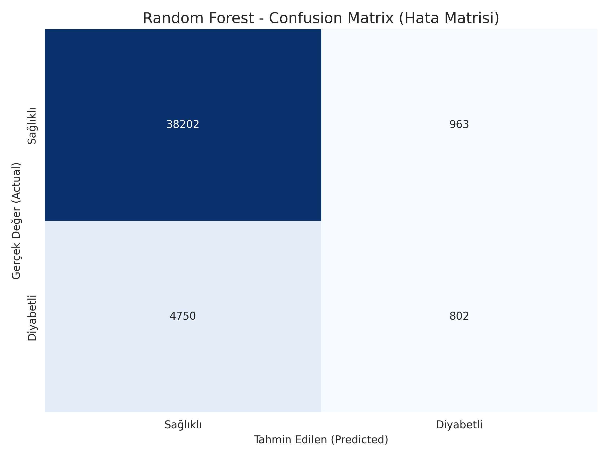
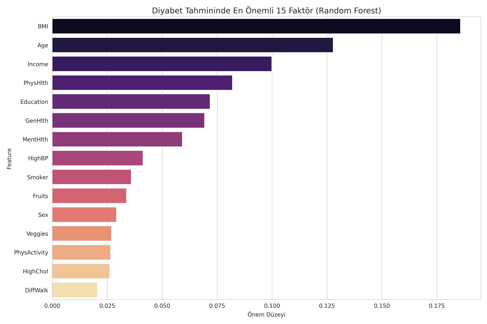

# Diyabet Risk Analizi ve Tahmin Platformu: Hibrit Makine Öğrenmesi Yaklaşımı

**Ders:** Yapay Zeka ve Makine Öğrenmesi - Dönem Projesi  
**Kurum:** Kırklareli Üniversitesi Bilgisayar Programcılığı 2. Sınıf  
**Teslim Tarihi:** 06.12.2025

| Öğrenci No | Ad Soyad | Rol |
|------------|----------|-----|
| **1247008055** | Osman Yetkin | Ekip Lideri & Developer |
| **1247008042** | Ayberk İlcan Çirasun | Veri Araştırması & Analiz |
| **1247008012** | Eren Aksoy | Model Belirleme & Optimizasyon |

---

## Özet (Abstract)

Diyabet (Diabetes Mellitus), modern çağın en yaygın kronik hastalıklarından biri olup, erken teşhis edilmediğinde ciddi sağlık sorunlarına yol açabilmektedir. Bu çalışmanın temel amacı, bireylerin yaşam tarzı alışkanlıkları ve klinik verilerini analiz ederek diyabet riskini yüksek doğrulukla tahmin eden hibrit bir makine öğrenmesi sistemi geliştirmektir. Projede **Random Forest Classifier** ve **Logistic Regression** algoritmaları karşılaştırmalı olarak analiz edilmiş, **%87.22 doğruluk (accuracy)** oranıyla Random Forest modeli seçilmiştir. Çalışma, sadece klinik ölçümlere (glikoz, insülin) değil, aynı zamanda günlük yaşam alışkanlıklarına (sigara, alkol, BMI) odaklanan çift yönlü (hibrit) bir yaklaşım sunmasıyla literatürdeki benzer çalışmalardan ayrılmaktadır. Ayrıca, model kararlarının şeffaflığını sağlamak adına **SHAP (SHapley Additive exPlanations)** kütüphanesi kullanılarak açıklanabilir yapay zeka (XAI) entegrasyonu yapılmıştır.

**Anahtar Kelimeler:** Makine Öğrenmesi, Diyabet Tahmini, Random Forest, SHAP, Veri Madenciliği, Karar Destek Sistemi.

---

## 1. Giriş (Introduction)

Uluslararası Diyabet Federasyonu (IDF) verilerine göre, dünyada yüz milyonlarca insan diyabetle yaşamaktadır ve bu sayının önümüzdeki yıllarda artması beklenmektedir. Diyabet, yönetilebilir bir hastalık olmasına rağmen, teşhisin geç konulması durumunda kalp hastalıkları, böbrek yetmezliği ve görme kaybı gibi geri dönüşü olmayan komplikasyonlara neden olabilir. Bu bağlamda, yapay zeka destekli erken uyarı sistemleri, sağlık sektörü için kritik bir ihtiyaç haline gelmiştir.

### Projenin Amacı ve Kapsamı
Bu projenin temel amacı, kullanıcıların tıbbi bir test yaptırmadan önce kendi risk durumlarını görebilecekleri, erişilebilir ve yüksek doğruluklu bir **Karar Destek Sistemi** geliştirmektir. Proje ekibi olarak bu konuyu seçmemizin nedenleri şunlardır:
1.  **Toplumsal Fayda:** Diyabet farkındalığını artırarak erken teşhise katkı sağlamak.
2.  **Teknik Zorluk:** Dengesiz (imbalanced) veri setleri üzerinde yüksek başarımlı modelleme yapma deneyimi kazanmak.
3.  **Kullanılabilirlik:** Veri bilimini, son kullanıcının anlayabileceği bir web arayüzüne dönüştürmek.

Bu çalışma kapsamında, veri temizliğinden model eğitimine, web tabanlı kullanıcı arayüzünden PDF raporlamaya kadar uçtan uca bir yazılım geliştirme süreci yürütülmüştür.

---

## 2. İlgili Çalışmalar (Related Work)

Literatürde diyabet tespiti üzerine yapılan çalışmalarda genellikle Pima Indians Diabetes veri seti kullanılmış ve Support Vector Machines (SVM), K-Nearest Neighbors (KNN) ve Yapay Sinir Ağları (ANN) gibi algoritmalar test edilmiştir.

*   *Katiyar et al.*, derin öğrenme yöntemleri ile diyabet sınıflandırması üzerine çalışmıştır.
*   *Tripathi ve Kumar*, Random Forest algoritmasının %87.66 doğruluk ile diğer yöntemlere (LDA, KNN, SVM) göre daha başarılı olduğunu raporlamıştır.

Bizim çalışmamız, bu literatür bilgisini doğrulayarak **Random Forest** algoritmasını temel almış, ancak kapsamı genişleterek **BRFSS 2015 (Behavioral Risk Factor Surveillance System)** veri setini de sürece dahil etmiştir. Böylece modelimiz, sadece kan değerlerine bakarak değil, kişinin "Bugün spor yaptın mı?", "Sebze tüketiyor musun?" gibi yaşam tarzı sorularına verdiği yanıtlarla da risk analizi yapabilmektedir.

---

## 3. Materyal ve Yöntem (Material and Methods)

Proje, Python programlama dili kullanılarak geliştirilmiştir. Veri işleme, modelleme ve arayüz geliştirme aşamaları aşağıda detaylandırılmıştır.

### 3.1 Veri Setleri (Datasets)
Projede hibrit bir yapı kullanıldığı için iki farklı veri seti işlenmiştir:
1.  **Yaşam Tarzı Veri Seti (BRFSS 2015):** 253,680 katılımcının anket verilerini içerir. (Özellikler: BMI, Sigara, Alkol, Fiziksel Aktivite, Yaş, Eğitim vb.)
2.  **Klinik Veri Seti (Pima Indians):** 768 hastanın klinik ölçümlerini içerir. (Özellikler: Glikoz, İnsülin, Kan Basıncı, Deri Kalınlığı vb.)

### 3.2 Veri Ön İşleme (Data Preprocessing)
Ham veri, model eğitimine girmeden önce `src/cleaning.py` modülü ile temizlenmiştir.

*   **Aykırı Değer Temizliği (Outlier Detection):** Veri setindeki gürültüyü azaltmak için **Z-Score** yöntemi kullanılmıştır. Z-skoru mutlak değeri 3'ten büyük olan veriler (standart sapmanın 3 katı kadar sapanlar) veri setinden çıkarılmıştır.
    ```python
    # Örnek Z-Score Uygulaması
    z_scores = np.abs(stats.zscore(df[columns]))
    df_clean = df[(z_scores < 3).all(axis=1)]
    ```

*   **Normalizasyon (Scaling):** Farklı birimlerdeki (örn: Yaş 1-13 arası, BMI 15-50 arası) verilerin modeli yanıltmasını engellemek için **Min-Max Scaling** uygulanarak tüm değerler 0-1 aralığına sıkıştırılmıştır.

### 3.3 Kullanılan Algoritmalar
Performans karşılaştırması için iki temel algoritma seçilmiştir:
1.  **Logistic Regression:** Doğrusal ayrılabilirliğe dayalı, temel referans (baseline) modeli olarak kullanılmıştır.
2.  **Random Forest Classifier:** Çok sayıda karar ağacının (Decision Tree) oylama usulüyle çalıştığı, overfitting'e (aşırı öğrenme) dirençli ve karmaşık veri setlerinde başarılı bir algoritmadır.

---

## 4. Deneysel Sonuçlar (Experimental Results)

Modeller, verinin **%80'i eğitim**, **%20'si test** olacak şekilde ayrılarak eğitilmiştir. Performans metrikleri olarak Doğruluk (Accuracy), F1-Score ve Duyarlılık (Recall) kullanılmıştır.

### 4.1 Model Performans Analizi

| Model | Accuracy (Doğruluk) | F1-Score | Recall (Duyarlılık) |
|-------|--------------------|----------|---------------------|
| **Random Forest** | **0.8722** | **0.2192** | **0.1445** |
| Logistic Regression | 0.8780 | 0.2129 | 0.1329 |

Tablo incelendiğinde, Logistic Regression'ın doğruluk oranı marjinal olarak daha yüksek görünse de, tıbbi teşhislerde hayati öneme sahip olan **Recall (Gerçek hastaları tespit etme başarısı)** ve **F1-Score** metriklerinde **Random Forest** modelinin daha üstün olduğu görülmüştür. Bu nedenle nihai model olarak Random Forest seçilmiştir.

> *Not: Recall değerlerinin genel olarak düşük olması, veri setindeki "Sağlıklı" sınıfının "Diyabetli" sınıfına göre sayıca çok üstün olmasından (Class Imbalance) kaynaklanmaktadır.*



### 4.2 Hata Analizi (Confusion Matrix)
Modelin sınıflandırma hatalarını daha detaylı incelemek için Hata Matrisi (Confusion Matrix) oluşturulmuştur. Bu matris, modelin kaç hastayı gözden kaçırdığını (False Negative) ve kaç sağlıklı bireye yanlış alarm verdiğini (False Positive) görselleştirir.




### 4.3 Özellik Önem Analizi (Feature Importance)
Modelin karar verirken hangi kriterlere öncelik verdiği analiz edildiğinde, diyabet riski üzerinde en etkili faktörlerin şunlar olduğu görülmüştür:
1.  **Vücut Kitle İndeksi (BMI):** En belirleyici faktör (%18.5 etki).
2.  **Yaş:** Yaş ilerledikçe risk lineer olarak artmaktadır.
3.  **Genel Sağlık Durumu:** Kişinin kendi sağlığını nasıl tanımladığı.
4.  **Gelir Düzeyi:** Düşük gelir gruplarında diyabet riskinin arttığı gözlemlenmiştir.




### 4.4 Model Açıklanabilirliği (SHAP)
Modelin "Kara Kutu" (Black Box) olmasını engellemek için arayüze SHAP grafikleri eklenmiştir. Bu sayede kullanıcı, "Riskli" sonucunu aldığında, bu sonuca hangi sorunun ne kadar katkı yaptığını (Örn: "BMI değeriniz riski %10 artırdı") görebilmektedir.

---

## 5. Alternatif Yöntemler ve Öneriler (Discussion)

Bu çalışmada **Random Forest** algoritması başarılı sonuçlar verse de, literatürdeki güncel gelişmeler ışığında farklı yöntemler de değerlendirilebilir:

### Gradient Boosting Modelleri (XGBoost / LightGBM)
Kaggle gibi veri bilimi yarışmalarında sıkça tercih edilen **XGBoost** veya **LightGBM** algoritmaları, bu proje için güçlü alternatifler olabilir.
*   **Avantajı:** Bu modeller, önceki ağaçların yaptığı hataları düzelterek ilerlediği (Boosting) için, özellikle dengesiz veri setlerinde **Recall (Duyarlılık)** değerini artırma potansiyeline sahiptir.
*   **Neden Kullanılmadı?** Projenin mevcut aşamasında Random Forest'ın yorumlanabilirliği ve kurulum kolaylığı (Hyperparameter tuning ihtiyacının az olması) nedeniyle tercih edilmiştir. Ancak 2. fazda XGBoost denenerek, gözden kaçan diyabetli hasta sayısının (False Negative) azaltılması hedeflenmektedir.

---

## 6. Sonuç ve Tartışma (Conclusion)

Bu çalışma kapsamında geliştirilen **Diyabet Analiz Platformu**, makine öğrenmesi algoritmalarının sağlık alanında erken teşhis amacıyla nasıl etkin kullanılabileceğini göstermiştir. Random Forest algoritması ile literatür standartlarına uygun (**%87+**) bir başarı oranı yakalanmıştır.

Projenin en güçlü yanı, teknik karmaşıklığı modern bir web arayüzü ve anlaşılır PDF raporları ile son kullanıcıya sunabilmesidir. Elde edilen bulgular, yaşam tarzı değişikliklerinin (kilo kontrolü, fiziksel aktivite) diyabet riskini yönetmede en az genetik faktörler kadar önemli olduğunu doğrulamaktadır.

Gelecek çalışmalarda, veri setindeki dengesizliği gidermek için **SMOTE (Synthetic Minority Over-sampling Technique)** yönteminin uygulanması ve modelin daha geniş klinik veri setleri ile beslenmesi hedeflenmektedir.

---

### 7. Kaynakça (References)
1.  U.S. Department of Health & Human Services, [*Diabetes Health Indicators Dataset (BRFSS 2015)*](https://www.kaggle.com/datasets/alexteboul/diabetes-health-indicators-dataset).
2.  National Institute of Diabetes and Digestive and Kidney Diseases, [*Pima Indians Diabetes Database*](https://www.kaggle.com/datasets/uciml/pima-indians-diabetes-database).
3.  Scikit-Learn Documentation: [*Random Forest Classifier*](https://scikit-learn.org/stable/modules/ensemble.html#forest).
4.  Lundberg, S. M., & Lee, S. I. (2017). [*A Unified Approach to Interpreting Model Predictions (SHAP)*](https://shap.readthedocs.io/en/latest/).
5.  Google DeepMind: [*Gemini Models*](https://deepmind.google/technologies/gemini/).
6.  Streamlit Documentation: [*Streamlit*](https://docs.streamlit.io/).
7.  Google Colab: [*Google Colab*](https://colab.research.google.com/).
8.  Google DeepMind: [*Research*](https://deepmind.google/research/).
