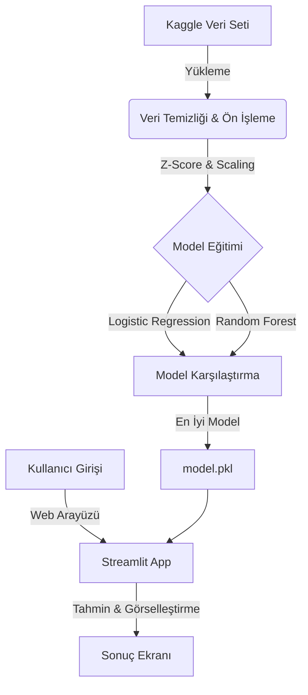

# Diyabet Risk Analizi ve Tahmin Platformu


> **Makine Öğrenmesi Dönem Projesi**  
> Sağlık verilerini analiz ederek diyabet riskini tahminleyen, uçtan uca geliştirilmiş yapay zeka destekli karar destek sistemi.

---

## Proje Ekibi

| Öğrenci No | Ad Soyad | Rol |
|------------|----------|-----|
| **1247008055** | **Osman Yetkin** | Ekip Lideri & Developer |
| **1247008042** | **Ayberk İlcan Çirasun** | Veri Araştırması & Analiz |
| **1247008012** | **Eren Aksoy** | Model Belirleme & Optimizasyon |

---

## Proje Özeti

Bu projenin temel amacı, **Kaggle Diabetes Health Indicators Dataset** kullanılarak diyabet hastalığı ile ilişkili risk faktörlerini belirlemek ve bireylerin diyabet olma ihtimalini hesaplayan yüksek doğruluklu bir makine öğrenmesi modeli geliştirmektir.

Proje, sadece akademik bir çalışma olmanın ötesinde; **Glassmorphism** tasarım diline sahip modern web arayüzü ve manuel olarak kodlanmış veri işleme boru hatları (pipelines) ile profesyonel bir ürün niteliği taşımaktadır.

### Temel Özellikler
- **Manuel Veri İşleme:** Hazır kütüphaneler yerine, eğitim amaçlı olarak manuel kodlanmış `Z-Score` aykırı değer temizliği ve `Min-Max Scaling`.
- **Yüksek Performanslı Model:** Random Forest algoritması ile optimize edilmiş tahminleme motoru.
- **Hibrit Analiz Sistemi:** Hem yaşam tarzı alışkanlıklarına hem de klinik/genetik verilere (Glikoz, İnsülin, Soyağacı) göre çift yönlü risk analizi.
- **Açıklanabilir Yapay Zeka (SHAP):** Modelin neden "Riskli" veya "Sağlıklı" sonucunu verdiğini açıklayan detaylı grafikler.
- **PDF Raporlama:** Sonuçlarınızı ve girdilerinizi içeren, doktorunuzla paylaşabileceğiniz profesyonel PDF raporu.
- **Modern Arayüz:** Streamlit ve özel CSS tasarımları ile geliştirilmiş kullanıcı deneyimi.
- **Gerçek Zamanlı Analiz:** Optimize edilmiş algoritmalarla anlık sonuç üretimi.

---

## Sistem Mimarisi



---

## Veri Seti ve Metodoloji

Bu proje, **Hibrit (Çift Motorlu) Bir Yapı** üzerine kurulmuştur. İki farklı veri seti ve iki ayrı yapay zeka modeli kullanır:

### 1. Yaşam Tarzı Modeli (BRFSS 2015)
*   **Kaynak:** [Kaggle - Diabetes Health Indicators Dataset](https://www.kaggle.com/alexteboul/diabetes-health-indicators-dataset)
*   **Kapsam:** 253,680 Kişi (ABD)
*   **Odak:** Yaşam tarzı alışkanlıkları (Sigara, Alkol, Spor, Beslenme).
*   **Algoritma:** Random Forest Classifier

### 2. Klinik & Genetik Model (Pima Indians)
*   **Kaynak:** [National Institute of Diabetes and Digestive and Kidney Diseases](https://www.kaggle.com/uciml/pima-indians-diabetes-database)
*   **Kapsam:** 768 Kişi (Pima Yerlileri)
*   **Odak:** Klinik ölçümler (Glikoz, İnsülin, Tansiyon) ve **Genetik Yatkınlık (Soyağacı)**.
*   **Algoritma:** Random Forest Classifier

### Hibrit Sistem Mimarisi
Kullanıcı, arayüz üzerinden **"Yaşam Tarzı Analizi"** veya **"Klinik & Genetik Analiz"** modları arasında geçiş yapabilir. Sistem, seçilen moda göre ilgili yapay zeka modelini devreye sokar.

### Yaş Grubu Kodlaması (Age Encoding)
Veri setinde yaş bilgisi gizlilik nedeniyle 13 farklı kategoriye ayrılmıştır:

| Kod | Yaş Aralığı | Kod | Yaş Aralığı |
|:---:|:------------|:---:|:------------|
| **1** | 18 - 24 | **8** | 55 - 59 |
| **2** | 25 - 29 | **9** | 60 - 64 |
| **3** | 30 - 34 | **10** | 65 - 69 |
| **4** | 35 - 39 | **11** | 70 - 74 |
| **5** | 40 - 44 | **12** | 75 - 79 |
| **6** | 45 - 49 | **13** | 80+ |
| **7** | 50 - 54 | | |

### Uygulanan İşlemler
1.  **Veri Temizliği (`src/cleaning.py`):**
    *   Eksik veri analizi yapıldı.
    *   `Z-Score > 3` olan aykırı değerler (Outliers) manuel fonksiyonlarla temizlendi.
    *   Sürekli değişkenler 0-1 aralığına `Min-Max Scaling` ile oturtuldu.
2.  **Modelleme (`src/model.py`):**
    *   Veri %80 Eğitim, %20 Test olarak ayrıldı.
    *   **Random Forest** ve **Logistic Regression** modelleri eğitildi.
    *   F1-Score ve Recall metriklerine göre **Random Forest** (%87.2 Accuracy) seçildi.

---

## Kurulum ve Çalıştırma

Projeyi yerel ortamınızda çalıştırmak için:

### 1. Klonlama
```bash
git clone --
cd diyabet-analizi
```

### 2. Bağımlılıklar
```bash
pip install -r requirements.txt
```

### 3. Veri Hazırlığı ve Model Eğitimi
> **⚠️ ÖNEMLİ:** Github deposunda `model.pkl` dosyası (boyut sınırı nedeniyle) bulunmamaktadır. Uygulamayı çalıştırmadan önce aşağıdaki komutları çalıştırarak kendi bilgisayarınızda modeli eğitmeniz **ZORUNLUDUR**.

```bash
# Veriyi temizle ve işle
python src/cleaning.py

# Modeli eğit ve kaydet (Bu işlem model.pkl dosyasını oluşturacaktır)
python src/model.py
```

### 4. Uygulamayı Başlat
```bash
streamlit run src/app.py
```

---

## Model Performans Metrikleri

| Model | Accuracy | F1-Score | Recall |
|-------|----------|----------|--------|
| **Random Forest** | **0.8722** | **0.2192** | **0.1445** |
| Logistic Regression | 0.8780 | 0.2129 | 0.1329 |

> **Not:** Veri setindeki sınıf dengesizliği (Class Imbalance) nedeniyle Recall değerleri düşük seyretmektedir. Bu durum, projenin sonraki fazlarında SMOTE tekniği ile iyileştirilecektir.

---

## Proje Kısıtları ve Açıklamalar

### 1. Genetik Veri Eksikliği
Kullanıcılar haklı olarak "Ailede diyabet öyküsü" veya "İnsülin direnci" gibi genetik faktörlerin neden sorulmadığını merak edebilir.
*   **Sebep:** Kullandığımız **BRFSS 2015** veri seti, genetik test sonuçlarını değil, kişilerin beyanına dayalı anket cevaplarını içerir. Bu veri setinde aile geçmişine dair bir sütun bulunmamaktadır.
*   **Çözüm:** Bu proje, mevcut davranışsal ve fiziksel göstergelerle (BMI, Tansiyon, Yaş vb.) yapılabilecek en iyi tahmini sunmayı amaçlar.

### 2. Grafiklerdeki Örneklem (Sampling)
Web arayüzündeki grafikler, performans optimizasyonu için 250.000 satırlık verinin tamamı yerine, rastgele seçilen **1000 kişilik bir örneklem** üzerinden çizdirilmektedir.
*   Bu nedenle grafiklerdeki çizgiler bazen kırıklı görünebilir.
*   Ancak genel eğilim tüm popülasyonu doğru yansıtmaktadır.

---

## Gelecek Çalışmalar

Projenin 2. fazında aşağıdaki geliştirmelerin yapılması planlanmaktadır:

1.  **Dengesiz Veri Yönetimi (SMOTE):**
    *   Mevcut veri setinde sağlıklı birey sayısı çok fazladır. Modelin diyabetli bireyleri daha iyi yakalaması için **SMOTE (Synthetic Minority Over-sampling Technique)** kullanılarak veri dengelenecektir.
2.  **Model Açıklanabilirliği (XAI - SHAP):**
    *   Modelin neden "Yüksek Risk" sonucu verdiğini kullanıcıya açıklamak için **SHAP (SHapley Additive exPlanations)** kütüphanesi entegre edilecektir.
3.  **PDF Raporlama:**
    *   Kullanıcıların risk analiz sonuçlarını doktorlarıyla paylaşabilmeleri için **PDF İndir** özelliği eklenecektir.
4.  **Dockerizasyon:**
    *   Uygulamanın her ortamda sorunsuz çalışması için Docker konteyner yapısına geçirilecektir.

---

## Dosya Yapısı

```
DiyalizAnalizi/
├── datasets/               # Veri setleri
├── src/                    # Kaynak kodlar
│   ├── app.py              # UI (Streamlit)
│   ├── cleaning.py         # Veri İşleme
│   └── model.py            # ML Modelleri
├── requirements.txt        # Kütüphaneler
└── README.md               # Dökümantasyon
```

---
*2025 Makine Öğrenmesi Dersi Dönem Projesi*
