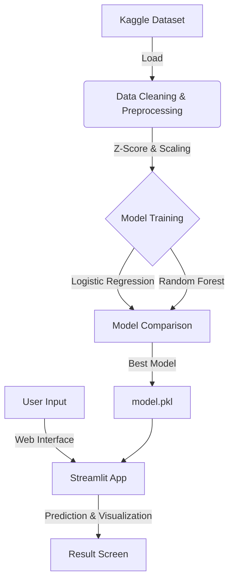

# Diabetes Risk Analysis and Prediction Platform


> **Machine Learning Term Project**  
> An end-to-end AI-powered decision support system that analyzes health data to predict diabetes risk.

---

## Project Team

| Student ID | Name Surname | Role |
|------------|----------|-----|
| **1247008055** | **Osman Yetkin** | Team Lead & Developer |
| **1247008042** | **Ayberk İlcan Çirasun** | Data Research & Analysis |
| **1247008012** | **Eren Aksoy** | Model Selection & Optimization |

---

## Project Summary

The main objective of this project is to use the **Kaggle Diabetes Health Indicators Dataset** to identify risk factors associated with diabetes and develop a high-accuracy machine learning model that calculates the probability of individuals having diabetes.

Beyond being just an academic study, the project carries the quality of a professional product with its **Glassmorphism** design language modern web interface and manually coded data processing pipelines.

### Key Features
- **Manual Data Processing:** Instead of ready-made libraries, `Z-Score` outlier cleaning and `Min-Max Scaling` were manually coded for educational purposes.
- **High-Performance Model:** Prediction engine optimized with Random Forest algorithm.
- **Hybrid Analysis System:** Two-way risk analysis based on both lifestyle habits and clinical/genetic data (Glucose, Insulin, Pedigree).
- **Explainable AI (SHAP):** Detailed charts explaining why the model gave a "Risky" or "Healthy" result.
- **PDF Reporting:** A professional PDF report containing your results and inputs that you can share with your doctor.
- **Modern Interface:** Modern user experience developed with Streamlit and custom CSS designs.
- **Real-Time Analysis:** Instant result generation with optimized algorithms.

### Application Interface
Examples from our modern web interface:


*Figure 1: Lifestyle Analysis Mode and Risk Calculation Screen*


*Figure 2: Clinical & Genetic Data Analysis Screen*

---

## System Architecture



---

## Dataset and Methodology

This project is built on a **Hybrid (Dual Engine) Structure**. It uses two different datasets and two separate AI models:

### 1. Lifestyle Model (BRFSS 2015)
*   **Source:** [Kaggle - Diabetes Health Indicators Dataset](https://www.kaggle.com/alexteboul/diabetes-health-indicators-dataset)
*   **Scope:** 253,680 People (USA)
*   **Focus:** Lifestyle habits (Smoking, Alcohol, Sports, Nutrition).
*   **Algorithm:** Random Forest Classifier

### 2. Clinical & Genetic Model (Pima Indians)
*   **Source:** [National Institute of Diabetes and Digestive and Kidney Diseases](https://www.kaggle.com/uciml/pima-indians-diabetes-database)
*   **Scope:** 768 People (Pima Indians)
*   **Focus:** Clinical measurements (Glucose, Insulin, Blood Pressure) and **Genetic Predisposition (Pedigree)**.
*   **Algorithm:** Random Forest Classifier

### Hybrid System Architecture
The user can switch between **"Lifestyle Analysis"** or **"Clinical & Genetic Analysis"** modes via the interface. The system activates the relevant AI model according to the selected mode.

### Age Group Encoding
Age information in the dataset is divided into 13 different categories for privacy reasons:

| Code | Age Range | Code | Age Range |
|:---:|:------------|:---:|:------------|
| **1** | 18 - 24 | **8** | 55 - 59 |
| **2** | 25 - 29 | **9** | 60 - 64 |
| **3** | 30 - 34 | **10** | 65 - 69 |
| **4** | 35 - 39 | **11** | 70 - 74 |
| **5** | 40 - 44 | **12** | 75 - 79 |
| **6** | 45 - 49 | **13** | 80+ |
| **7** | 50 - 54 | | |

### Operations Applied
1.  **Data Cleaning (`src/cleaning.py`):**
    *   Missing data analysis was performed.
    *   Outliers with `Z-Score > 3` were cleaned with manual functions.
    *   Continuous variables were fitted to the 0-1 range with `Min-Max Scaling`.
2.  **Modeling (`src/model.py`):**
    *   Data was split as 80% Training, 20% Test.
    *   **Random Forest** and **Logistic Regression** models were trained.
    *   **Random Forest** (87.2% Accuracy) was selected based on F1-Score and Recall metrics.

---

## Installation and Execution

To run the project in your local environment:

### 1. Cloning
```bash
git clone https://github.com/osmanveyetkin/Diabetes-Analysis.git
cd Diabetes-Analysis
```

### 2. Dependencies
```bash
pip install -r requirements.txt
```

### 3. Data Preparation and Model Training
> **⚠️ IMPORTANT:** The `model.pkl` file is not present in the Github repository (due to size limit). You **MUST** train the model on your own computer by running the following commands before running the application.

```bash
# Clean and process data
python src/cleaning.py

# Train and save the model (This process will create the model.pkl file)
python src/model.py
```

### 4. Start the Application
```bash
streamlit run src/app.py
```

---

## Model Performance Metrics

| Model | Accuracy | F1-Score | Recall |
|-------|----------|----------|--------|
| **Random Forest** | **0.8722** | **0.2192** | **0.1445** |
| Logistic Regression | 0.8780 | 0.2129 | 0.1329 |

> **Note:** Recall values are low due to Class Imbalance in the dataset. This situation will be improved with SMOTE technique in the later phases of the project.

---

## Project Constraints and Explanations

### 1. Lack of Genetic Data
Users may rightfully wonder why genetic factors such as "Family history of diabetes" or "Insulin resistance" are not asked.
*   **Reason:** The **BRFSS 2015** dataset we use contains survey responses based on self-declaration, not genetic test results. There is no column for family history in this dataset.
*   **Solution:** This project aims to provide the best prediction possible with existing behavioral and physical indicators (BMI, Blood Pressure, Age, etc.).

### 2. Sampling in Charts
The charts in the web interface are drawn over a randomly selected **sample of 1000 people** instead of the entire 250,000 rows of data for performance optimization.
*   Therefore, the lines in the charts may sometimes appear jagged.
*   However, the general trend accurately reflects the entire population.

---

## Future Work

The following improvements are planned for Phase 2 of the project:

1.  **Imbalanced Data Management (SMOTE):**
    *   The number of healthy individuals in the current dataset is very high. **SMOTE (Synthetic Minority Over-sampling Technique)** will be used to balance the data so that the model can better capture diabetic individuals.
2.  **Model Explainability (XAI - SHAP):**
    *   **SHAP (SHapley Additive exPlanations)** library will be integrated to explain to the user why the model gave a "High Risk" result.
3.  **PDF Reporting:**
    *   **PDF Download** feature will be added so that users can share their risk analysis results with their doctors.
4.  **Dockerization:**
    *   The application will be moved to Docker container structure to run smoothly in every environment.

---

## File Structure

```
Diabetes-Analysis/
├── datasets/               # Datasets
├── src/                    # Source codes
│   ├── app.py              # UI (Streamlit)
│   ├── cleaning.py         # Data Processing
│   └── model.py            # ML Models
├── requirements.txt        # Libraries
└── README.md               # Documentation
```

---
*2025 Machine Learning Course Term Project*
